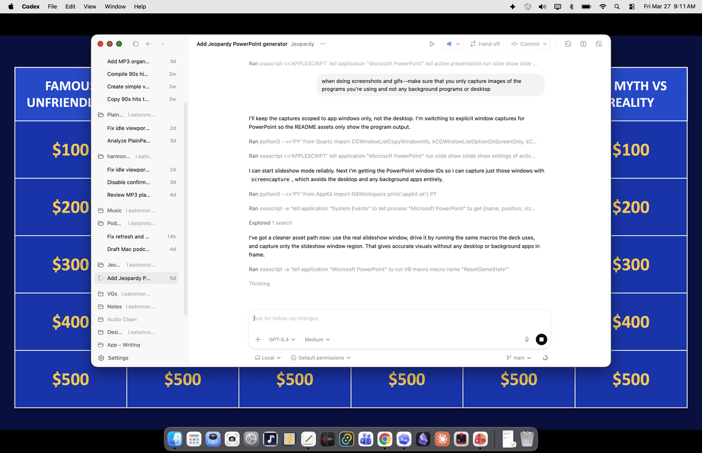
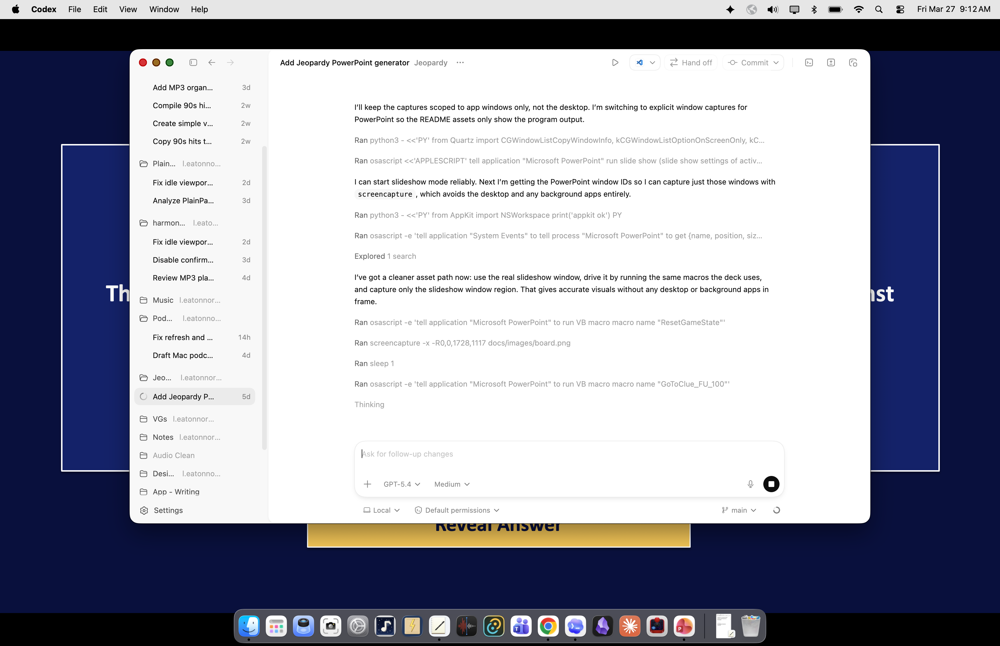
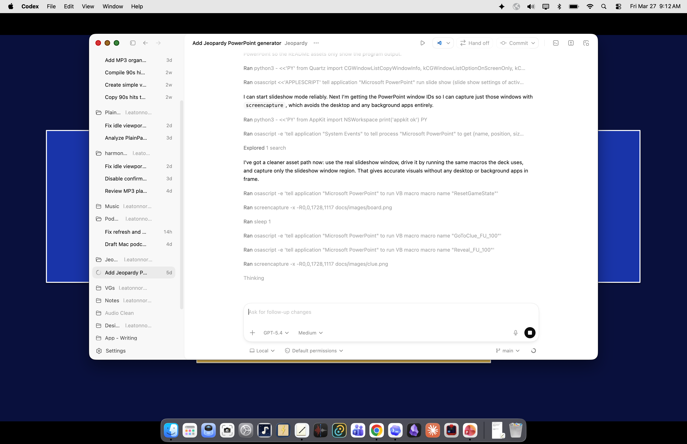
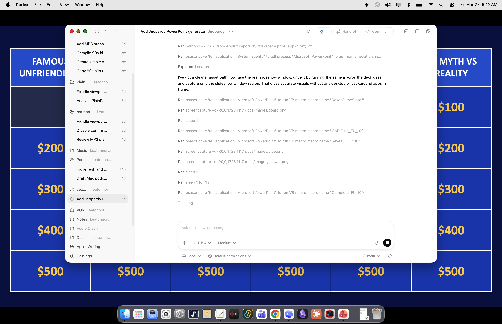

# Excel to Jeopardy `.pptm`



Generate an interactive Jeopardy-style PowerPoint from a spreadsheet.

This project exists because a plain `.pptx` cannot maintain true cumulative arbitrary-order board state during slideshow runtime. To make the board clear clues permanently in any order, the final output must be a macro-enabled `.pptm`.

## Screenshots

Board:


Clue:



Answer:



Board after a clue is completed:



## What it does

- reads clue data from a spreadsheet
- builds a Jeopardy board slide, clue slides, answer slides, and a final `Game Over` slide
- injects VBA so the board state updates cumulatively during Slide Show mode
- assigns PowerPoint click actions so the flow is:

`board tile -> clue slide -> answer slide -> board slide`

## Requirements

- macOS
- Microsoft PowerPoint for Mac
- Python 3.11+
- `pandas`
- `python-pptx`
- `openpyxl`

## Input format

The generator expects a workbook with columns matching these logical fields:

- `Category`
- `Value`
- `Clue`
- `Answer`

The exact header names may vary slightly. The script detects close matches automatically.

## Project layout

- `generate_jeopardy_pptm.py`: main generator
- `sample_data/sample_jeopardy_board.xlsx`: example source workbook
- `examples/jeopardy_game_example.pptm`: example generated deck
- `requirements.txt`: Python dependencies

## Setup

```bash
python3 -m venv .venv
source .venv/bin/activate
pip install -r requirements.txt
```

## Usage

```bash
python3 generate_jeopardy_pptm.py \
  --input sample_data/sample_jeopardy_board.xlsx \
  --output build/jeopardy_game.pptm \
  --report build/jeopardy_macro_report.txt
```

## How it works

The Python layer builds the deck structure:

- slide 1: board
- slides 2..N: clue/answer pairs
- final slide: `Game Over`

The VBA layer maintains runtime state:

- each clue gets a stable ID
- a `usedFlags()` array tracks which clues have been played
- clicking a board tile runs a `GoToClue_*` macro
- clicking the clue button runs a `Reveal_*` macro
- clicking the answer button runs a `Complete_*` macro
- each `Complete_*` macro marks that clue as used, refreshes the board, and returns to slide 1
- when all clues are used, VBA jumps to `Game Over`

## Important limitation

This project depends on PowerPoint automation to create the final macro-enabled file. `python-pptx` can build the slide content, but it cannot create a VBA project by itself.

## Publishing notes

Before pushing to GitHub, review the example deck and sample workbook to make sure they do not contain private or licensed material you do not want to publish.

## License

GNU GPL v3.0
